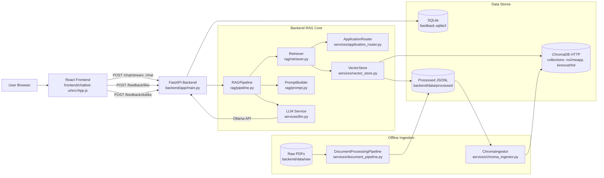

# Architecture Overview

## Purpose

This document provides a stable, implementation-level map of the repository so contributors can quickly understand:

- Where frontend and backend responsibilities live
- Which services own retrieval, routing, and generation
- How ChromaDB and SQLite are used
- Which models are used and for what purpose

---

## 1) Repository Map

```text
rag-healthcare-chatbot/
  backend/
    app/
      main.py                  # FastAPI app and API routes
      config.py                # Runtime constants and model/service config
      models/                  # Pydantic request/response/feedback models
      rag/                     # RAG orchestration (pipeline, retriever, prompt)
      services/                # Routing, vector store, LLM, ingestion, feedback, admin
    data/
      raw/                     # Input PDFs
      processed/               # Chunked JSONL output per app/domain
      feedback.sqlite3         # User feedback persistence
      index.faiss              # Legacy artifact (runtime retrieval currently Chroma-first)
    scripts/
      run_chunking.py          # Chunk PDFs; optional Chroma ingest
      build_index.py           # Ingest processed chunks into Chroma
    tests/
      test_main_api.py
      test_retriever.py
      test_vector_store.py
      test_chroma_admin.py
  frontend/
    chatbot-ui/
      src/App.js               # Main chat UI and streaming client logic
      src/App.css              # UI styling
      package.json             # React scripts and dependencies
```

---

## 2) High-Level System Architecture



---

## 3) Frontend Architecture

Primary entrypoint: `frontend/chatbot-ui/src/App.js`

Key responsibilities:

- Maintains chat session state (messages, sending status, errors, theme)
- Sends streaming chat requests to `http://127.0.0.1:8000/chat/stream`
- Supports optional app scoping (`auto`, `kinexushhd`, `nx2meapp`)
- Sends recent conversation history for contextual retrieval
- Parses NDJSON stream events:
  - `meta` (routing + sources)
  - `token` (incremental assistant text)
  - `done` (completion marker)
  - `error` (backend error payload)
- Collects explicit like/dislike feedback to backend feedback endpoints

Notable UI behavior:

- Displays selected route/app and source count in each bot message
- Shows typing/generating status while stream is active
- Handles fallback text when response body is empty

---

## 4) Backend Architecture

Primary entrypoint: `backend/app/main.py`

API routes:

- `POST /chat`
  - Synchronous response path
- `POST /chat/stream`
  - Streaming NDJSON response path
- `POST /feedback/like`
- `POST /feedback/dislike`
- Chroma admin endpoints:
  - `GET /chroma/collections`
  - `GET /chroma/collections/{name}`
  - `GET /chroma/collections/{name}/overview`
  - `GET /chroma/collections/{name}/records`
  - `GET /chroma-admin`

Startup behavior:

- FastAPI lifespan warmup calls:
  - `RAGPipeline.retriever.warmup()`
  - `RAGPipeline.llm.warmup()`

Core orchestration is delegated to `RAGPipeline` in `backend/app/rag/pipeline.py`.

---

## 5) Retrieval and Routing Architecture

### Retriever (`rag/retriever.py`)

- Converts request filters/history into retrieval call shape
- Resolves collection route using:
  1. explicit app/collection filter (if present)
  2. router heuristic/model decision
- Calls vector search with metadata filters
- Caches retrieval results (`RETRIEVAL_CACHE_SIZE`)

### Router (`services/application_router.py`)

Targets exactly one app collection:

- `nx2meapp` (patient-facing app topics)
- `kinexushhd` (provider portal topics)

Resolution strategy:

1. explicit filter route
2. heuristic alias/keyword route
3. cached route
4. Ollama-based routing fallback (`ROUTER_MODEL`)
5. safe fallback route

---

## 6) Vector Search and Reranking

Component: `services/vector_store.py`

Search strategy is hybrid:

1. Semantic retrieval from Chroma collection query
2. Lexical fallback over processed JSONL chunks
3. Deduplication and custom scoring/reranking

Reranking emphasizes practical support intent (for example login/password/reset/MFA patterns).

Data sources used at runtime:

- Chroma collection documents + metadata
- Processed chunk files in `backend/data/processed/<app>/*_chunks.jsonl`

---

## 7) Prompting and Generation

### Prompt Builder (`rag/prompt.py`)

- Builds bounded context prompt with:
  - short recent history (last 2 turns)
  - top chunks (bounded by prompt constants)
  - strict style and support constraints
- Includes explicit fallback language for missing context

### LLM Service (`services/llm.py`)

- Calls Ollama `/api/generate`
- Supports both non-stream and stream modes
- Applies generation limits from config

---

## 8) Database and Persistence

### ChromaDB (primary retrieval store)

- HTTP client in `services/chroma_client.py`
- Collections are app-scoped (for example `nx2meapp`, `kinexushhd`)
- Ingestion performed by `services/chroma_ingestor.py`

### SQLite (feedback store)

- File: `backend/data/feedback.sqlite3`
- Service: `services/feedback_store.py`
- Canonical table: `feedback`
  - upserts by `message_id`
  - stores `feedback_type`, `question`, `answer`, timestamps
- Legacy `likes`/`dislikes` tables are migration-compatible

---

## 9) Models and Configuration

### Pydantic Models

- `models/request.py`
  - `ChatRequest` includes question, app, filters, patient_id, history
  - `to_where()` composes metadata filters for retrieval
- `models/feedback.py`
  - feedback request schema
- `models/response.py`
  - response schema container

### Config (`app/config.py`)

Defines:

- Embedding model (`MODEL_NAME`)
- LLM/router model names
- Chroma host/port
- Prompt and retrieval limits (`TOP_K`, chunk limits)
- Cache sizes
- Paths for raw and processed data

---

## 10) Operational Notes

- Backend expects Chroma server reachable on configured host/port.
- Backend expects Ollama reachable on configured URL.
- If collection is missing, runtime returns actionable ingestion instructions.
- CORS is configured for frontend local development URLs.

---

## 11) Suggested Contributor Workflow

1. Understand this architecture document fully.
2. Read runtime flow details in `docs/02-runtime-and-data-flows.md`.
3. Run tests in `backend/tests` before changing retrieval or routing logic.
4. Validate route decisions and sources via streaming metadata in UI.
5. Use Chroma admin endpoints to inspect collection health before debugging model output.
