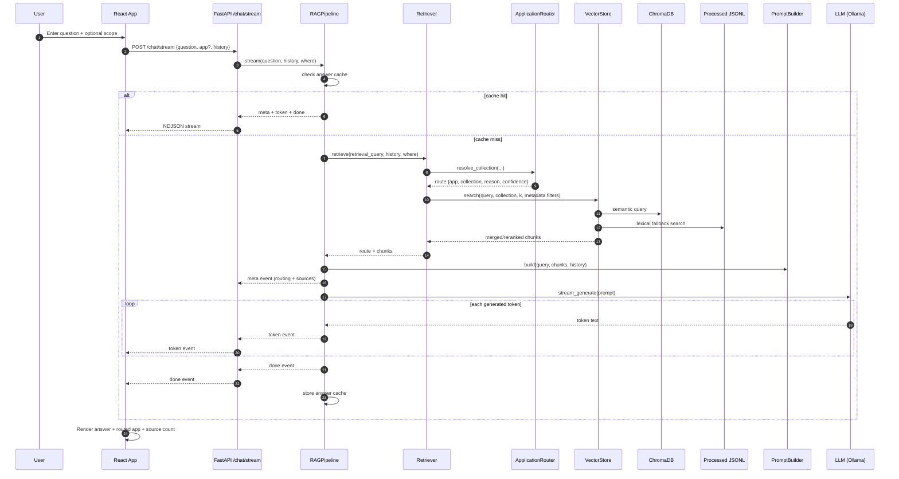
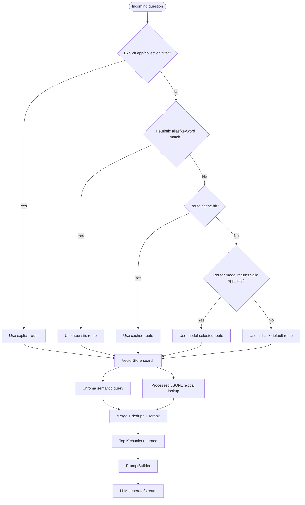
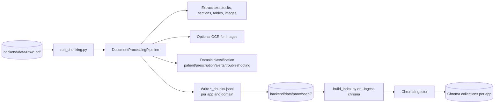
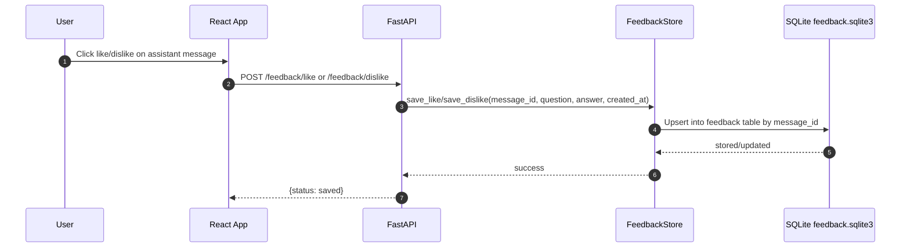

# Runtime and Data Flows

This document explains how data moves through the system at runtime and during ingestion.

---

## 1) Runtime Chat Flow (Streaming)

Primary route: `POST /chat/stream`

Event contracts consumed by frontend:

- `meta`: routing info and retrieved sources
- `token`: incremental answer text
- `done`: generation complete
- `error`: stream-level runtime issue

---

## 2) Runtime Chat Flow (Non-Streaming)

Primary route: `POST /chat`

1. Frontend or client sends `question`, optional `app`, optional `history`.
2. Backend calls `RAGPipeline.run(...)`.
3. Pipeline retrieves route + sources, generates single answer.
4. Returns JSON payload containing:
   - `answer`
   - `sources`
   - `collection`
   - `app`
   - `routing`

---

## 3) Retrieval + Routing Decision Flow

---

## 4) Ingestion and Indexing Flow

Purpose: transform raw PDFs into chunked records and ingest into Chroma collections.

Ingestion ownership:

- Chunk generation: `services/document_pipeline.py`
- Chroma writes: `services/chroma_ingestor.py`
- Script orchestration: `scripts/run_chunking.py`, `scripts/build_index.py`

---

## 5) Feedback Flow

Design behavior:

- Feedback is idempotent by `message_id` via upsert.
- Changing from like to dislike (or reverse) updates same row.

---

## 6) Caching Behavior

Three LRU-like caches are used to reduce repeated compute and calls:

- Route cache in `ApplicationRouter`
- Retrieval cache in `Retriever`
- Answer cache in `RAGPipeline`

Cache keys include normalized query + recent history + filters to preserve context sensitivity.

---

## 7) Failure Modes and Typical Symptoms

1. Chroma unavailable
   - Symptom: runtime retrieval failures, collection endpoints failing
   - Check: Chroma server status and configured host/port

2. Missing collections
   - Symptom: explicit runtime message instructing ingestion steps
   - Fix: run chunking/ingestion scripts and verify collections

3. Ollama unavailable
   - Symptom: generation failures and 503-style backend behavior
   - Check: Ollama service/model readiness

4. Empty retrieval context
   - Symptom: fallback answer about missing knowledge base context
   - Check: route selected, chunk quality, and ingestion coverage

---

## 8) Test Coverage Map

Current backend tests verify critical architecture contracts:

- `test_main_api.py`
  - API behavior, stream formatting, error handling, feedback delegation
- `test_retriever.py`
  - explicit scope bypass and collection targeting
- `test_vector_store.py`
  - reranking and lexical fallback behavior
- `test_chroma_admin.py`
  - admin record shaping and summary payload contracts

---

## 9) Contributor Checklist Before Major Changes

1. Confirm whether change is runtime-path or ingestion-path.
2. Validate app routing assumptions (`nx2meapp` vs `kinexushhd`).
3. Run backend tests before and after modification.
4. Verify streaming event contract remains unchanged for frontend.
5. If changing retrieval ranking, validate with representative support questions.
6. If changing ingestion, confirm JSONL schema remains compatible with current vector ingestion.

---

## 10) Glossary

- Route: selected app/collection target for retrieval.
- Chunk: indexed text unit (section/table/image-derived) with metadata.
- Semantic retrieval: embedding similarity from Chroma.
- Lexical fallback: keyword/token match against processed JSONL chunks.
- NDJSON stream: newline-delimited JSON events used for token streaming.
